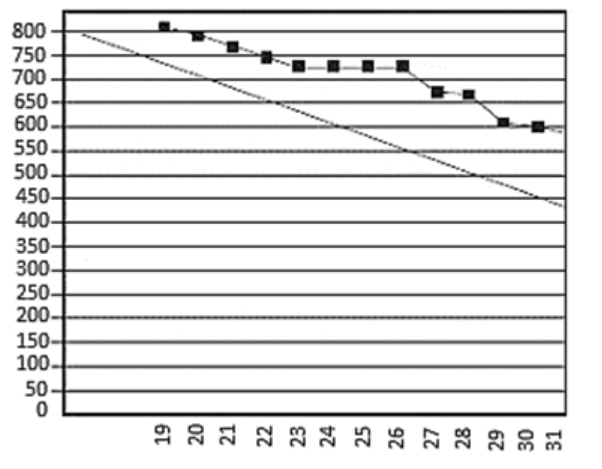

# Topic 2

1. While reviewing the sprint burn down during a stand up, the scrum team identifies that they have fallen behind. Upon further discussion, they discover that some quality assurance (QA) team members were unable to use the new automation framework, which caused a bottleneck. What should the scrum team do?
    - [ ] A. For upcoming sprints, have QA team members ensure that their respective skill sets are considered when accepting stories
    - [ ] B. Have QA team members with the appropriate skills sets spend extra time to help the team succeed
    - [ ] C. Ensure that QA team members who lack the appropriate skill sets sign up for training within the next few weeks
    - [ ] D. Ask QA team members experienced with the new automation framework to cross-train the other QA members

    

      
Answer

      D.

    

2. A customer and a product delivery team meet to discuss a product's attributes, goals, expectations, hypothesis, and high-level needs. What is a benefit of this meeting?
    - [ ] A. The team will learn how its contribution will create product value
    - [ ] B. It will enable team acceptance of client priorities
    - [ ] C. It will enable the team to see the entire project in one glance
    - [ ] D. It will enable the team to ask any questions to the customer upfront

    

      
Answer

      D:
      - A. The team will learn how its contribution will create product value -> it can be done with product vision
      - B. It will enable team acceptance of client priorities -> it can be done via backlog, acc,crit., DoD.
      - C. It will enable the team to see the entire project in one glance -> it can be done with product vision
      - D. It will enable the team to ask any questions to the customer upfront -> it is the mose valuable output of personal meeting. Seems to be the correct answer.

    

3. The customer needs assistance in determining the efficiency of a set of process activities within the solution. What should the agile team do?
    - [ ] A. Discuss the efficiency at the next iteration retrospective
    - [ ] B. Review the process value stream to determine potential improvements
    - [ ] C. Review the value the customer receives from the user story to determine backlog priority
    - [ ] D. Discuss the performance of the solution at the next sprint review

    

      
Answer

      B: The goal of Value Stream Map is to optimize the flow of information or materials required to complete a process, thereby reducing the time it takes to create value and eliminating wasteful or unnecessary work. In value stream mapping, we create a visual map of a process flow, so that we can identify where delays, waste, and constraints are occurring. Once we identify the areas that could be improved in the process, we can then look for ways to remove those problems and make the process more efficient

    

4. An agile team member identifies a potential problem within the project team. How should the team's coach react?
    - [ ] A. Document the problem, escalate to the project manager, and develop a solution for the team
    - [ ] B. Add the problem to the backlog and assign resolution to a future iteration
    - [ ] C. Instruct the team to try to solve the problem within the team
    - [ ] D. Perform root cause analysis and report the problem to the product owner

    

      
Answer

      C: The question related to domain problem detection and solving. The domain deals with the agile practices used to prevent, identify, and resolve threats and issues, including catching problems early, tracking defects, managing risk, and engaging the team in solving problems.

    

5. During a current sprint, a team member asks permission from the scrum master to investigate an alternative design approach. What should the scrum master do?
    - [ ] A. Discourage the team member from deviating from the plan and document the request during the retrospective
    - [ ] B. Encourage the team member to research the issue and present the findings during the retrospective
    - [ ] C. Discourage the team member from using experimentation/spikes unless it is fully developed and accounts for a variety of use cases
    - [ ] D. Encourage the team member to use experimentation/spikes for continuous improvement and help the team understand why it is important

    

      
Answer

      D: According to Mike Griffiths, PMI-ACP Exam Prep, 1st Ed, Spikes are a key tool that agile teams use to head off problems and resolve them as early as possible. A spike is a short effort (usually timeboxed) that is devoted to exploring an approach, investigating an issue, or reducing a project risk. Although spikes can be done at any time during a project, they often take the form of brief exploratory iterations or proof-of-concept efforts that are done at the start of a project, before the development effort begins.

    

6. Two similar stories, A and B, are estimated at 3 story points. Story C, is estimated at 8 points. After an iteration in which A and C were completed, it is found that story A took much longer than story C. What should the agile practitioner do?
    - [ ] A. Assign story B more than 8 story points so to provide a better estimate
    - [ ] B. Add points to story B's iteration to account for the error but keep story B at 3 points
    - [ ] C. Assign more resources to story B to bring it in line with the estimate
    - [ ] D. Reestimate all stories including values for A, B and C

    

      
Answer

      A.

    

7. Prior to a retrospective, discussions among team members indicate conflict. An agile practitioner wants to ensure an open and safe environment during the retrospective. What should the agile practitioner do?
    - [ ] A. Review established ground rules with the team
    - [ ] B. Ask team members specific questions to identify the cause
    - [ ] C. Encourage the team to continue working to maintain the iteration's schedule
    - [ ] D. Meet with the product owner and stakeholders to discuss the issue

    

      
Answer

      A.

    

8. A product owner, new to the role, is very enthusiastic about an agile project with an energetic team. What should be done first to ensure successful delivery of the product?
    - [ ] A. Hold a meeting with the team and the product owner to develop the team charter, working agreement, guiding principles, and product vision
    - [ ] B. Ask the product owner to create the project vision and charter, and then discuss the guiding principles with the team
    - [ ] C. Hold a meeting during which the team can present the project charter, high-level project plan, and team values to the product owner
    - [ ] D. Send the product owner to formal product-owner training where the product owner can learn how to create a product vision

    

      
Answer

      A.

    

9. An agile practitioner wants to ensure that stakeholders have current information about a project's progress. What should the agile practitioner do?
    - [ ] A. Regularly circulate an updated, detailed version of the project plan
    - [ ] B. Frequently update the online project management office (PMO) repository site
    - [ ] C. Invite the stakeholders to daily stand ups
    - [ ] D. Post a project board in an area where all can view it

    

      
Answer

      D.

    

10. During a mature agile team's planning meeting, a team member proposes a new framework that would considerably reduce implementation time. However, the team lacks the confidence to try the new framework. To help the team gain confidence, what should the agile practitioner suggest?
    - [ ] A. Develop a spike
    - [ ] B. Create an Ishikawa diagram
    - [ ] C. Perform a pre-mortem analysis
    - [ ] D. Complete a variance and trend analysis

    

      
Answer

      A.

    

11. The team is in the middle of an iteration and there is an urgent request for a small change to be introduced to the committed scope. Unless this change is accepted, there is no value to the customers during this iteration. What must the agile practitioner do?
    - [ ] A. Add the new change request as a new user story in the product backlog for the upcoming iteration
    - [ ] B. Evaluate the impact of the change request and let the team and product owner decide and re-prioritize based on value
    - [ ] C. Recommend cancelling the current iteration and plan the change request into the next iteration
    - [ ] D. Recommend that the product owner add this change request as a user story to the backlog for the current iteration

    

      
Answer

      B.

    

12. An agile team member from a cross-functional team has been unable to complete assignments due to tasks assigned by the functional manager. What should the Scrum Master do?
    - [ ] A. Dismiss the team member
    - [ ] B. Discuss the situation with the functional manager
    - [ ] C. Report the functional manager to the project sponsor
    - [ ] D. Demand that the functional manager respects the project charter

    

      
Answer

      B.

    

13. What can an agile team use to prioritize stories?
    - [ ] A. Planning poker technique
    - [ ] B. Weighted average calculation
    - [ ] C. Risk-value quadrant
    - [ ] D. INVEST scale

    

      
Answer

      C.

    

14. The scrum master for a large project must provide an estimate of what can be delivered in six months. What should the scrum master do?
    - [ ] A. Commit to a specific feature set for delivery
    - [ ] B. Explain that a commitment will be provided after planning
    - [ ] C. Have the team estimate in story points to commit to a specific set of features
    - [ ] D. Use the team's historical velocity to calculate a range of features that can be delivered

    

      
Answer

      D.

    

15. More details for a story are required before the upcoming sprint planning meeting. What should the scrum master do?
    - [ ] A. Email the product owner requesting detailed story specifications and wait for a response
    - [ ] B. Gather the details from the team members before sprint planning
    - [ ] C. Schedule a story grooming session with the product owner before sprint planning
    - [ ] D. Conduct a planning poker session with the team

    

      
Answer

      C: Grooming (or refinement) is a meeting of the Scrum team in which the product backlog items are discussed and the next sprint planning is prepared. Product grooming is critical in product management because it means keeping the backlog up to date and getting backlog items ready for upcoming sprints

    

16. Senior management is frustrated at the lack of a detailed implementation plan that shows exactly when the project will end and when all requirements will be met. The team has been using a rolling wave planning approach so far on the project. How should the agile practitioner explain to senior management the benefits of this approach?
    - [ ] A. It ensures a consistent level of details is available in the project schedule
    - [ ] B. It prevents a wasteful buildup of requirements inventory that may never be processed
    - [ ] C. It provides a concrete definition of project scope, cost and duration
    - [ ] D. It allows the team to lock down the stories to be included in a release

    

      
Answer

      B: Thru rolling wave, downtime comprises elements which are considered as waste in product development. These elements including waiting, not using resources, overproduction etc. Rolling wave planning helps you get rid of this wasting and minimize downtime.

    

17. Midway through an iteration, an agile team learns that a team member will be unavailable for the next two iterations. As a high-performance team, what should the team do?
    - [ ] A. Raise an impediment that resource tasks will be blocked, and notify the product owner
    - [ ] B. Ask the delivery manager for a temporary resource
    - [ ] C. Ask the scrum master to assign that team member's tasks to the next available resource
    - [ ] D. Assume the team member's tasks to meet iteration goals, and notify the product owner

    

      
Answer

      D.

    

18. A mature agile team welcomes a new member. Due to poor experiences with a previous team, the new member is reluctant to communicate. What should the agile project leader do?
    - [ ] A. Bring up the new member's impediments at the next meeting to demonstrate team support of input
    - [ ] B. Assure the new member that inputs on impediments are valued, and demonstrate this at the next meeting
    - [ ] C. Have a senior lead work with the new member to avoid a negative impact on team productivity
    - [ ] D. Privately work with the new member to address any impediments

    

      
Answer

      B: From PMI’s Agile Practice Guide, Page 35 & 123: “4.2.1.1 SERVANT LEADERS FACILITATE: Additionally, a facilitator encourages collaboration through interactive meetings, informal dialog, and knowledge sharing. Servant leaders do this by becoming impartial bridge-builders and coaches, rather than by making decisions for which others should be responsible.”
      “Agile creates a culture of transparency: people show and share their work throughout development. This sharing of interim deliverables and being open and honest about successes, failures, and current state is transparency. Transparency requires courage.”

    

19. An organization highly values security. However, a team member on a project has found a way to save time and money with less robust security features. What should the team member do?
    - [ ] A. Influence the customer
    - [ ] B. Mention the idea at the next retrospective
    - [ ] C. Show the customer how much time and money would be saved
    - [ ] D. Present the idea at the next ceremony attended by stakeholders to obtain their input

    

      
Answer

      B.

    

20. When introducing agile processes to a company, a quality assurance (QA) manager resists and believes that the switch to agile will remove quality controls and documents. How should the agile practitioner address this concern?
    - [ ] A. Educate the QA manager that in agile, quality is integrated from the beginning to end of the project
    - [ ] B. Write backlog items that include QA as part of the description
    - [ ] C. Ask for the current QA documents and incorporate them into the technical debt backlog
    - [ ] D. Ask the product owner to write tests and QA controls into the acceptance criteria

    

      
Answer

      A.

    

21. During planning for the next iteration, an agile team identifies most of the story points that are expected to be delivered. How should an agile practitioner work with the team to help identify the iteration's remaining scope?
    - [ ] A. Convince the team to stop planning and keep the size small
    - [ ] B. Identify the technically minimal and achievable tasks
    - [ ] C. Refer to the remaining prioritized backlog items
    - [ ] D. Select some of the smallest items from the backlog

    

      
Answer

      C.

    

22. A company has decided to combine two similar products consisting of multiple teams into one product. Engaged customers want to know how the company is looking at re-organizing its teams. What strategy should be employed to re-organize the teams?
    - [ ] A. All the teams from both products should be simultaneously called together and allowed to completely self-manage
    - [ ] B. Teams that worked on similar components in the separate products should be combined to minimize disruption and capitalize on synergies
    - [ ] C. After grouping individuals by role, multi-discipline teams should be created that are comprised of one member from each role
    - [ ] D. Features should be prioritized and then teams should be organized around those priorities

    

      
Answer

      A: From PMI’s Agile Practice Guide, Page 39: “Agile encourages self-managing teams, where team members decide who will perform the work within the next period’s defined scope.”

    

23. Early in a project, stakeholder analysis is performed; however, an organizational restructure redefines key roles. What should the project team do?
    - [ ] A. Note the changes to the restructure and roles that affect team activities
    - [ ] B. Use direct engagement and two-way conversation to update the stakeholder analysis for any new stakeholder requirements
    - [ ] C. Email a copy of the project vision to those redefined for key roles and ask if they need to be involved in the project
    - [ ] D. Obtain a copy of the redefined key roles to update the stakeholder analysis

    

      
Answer

      B.

    

24. An agile team notices that the same problems continue to occur during multiple iterations. Several team members have suggestions to fix the problem. What is the proper agile approach to handle this?
    - [ ] A. Hold frequent retrospectives and share the responsibility for making changes
    - [ ] B. Understand that this is the nature of innovative business and strive to work harder
    - [ ] C. Collect team member feedback and discuss them privately with the product owner
    - [ ] D. Conduct a team-building exercise to increase trust among the team members

    

      
Answer

      A.

    

25. During the review session, the product owner discovers that the user interface has a response time of 10 seconds. The non-functional requirements state that it should respond in less than two seconds. The team complains that this requirement was not communicated to them. What should have been done to avoid this?
    - [ ] A. A comprehensive user story with all non-functional requirements should have been created
    - [ ] B. Non-functional requirements should have been added to the acceptance criteria
    - [ ] C. Non-functional requirements should have been added to the definition of done
    - [ ] D. A team review of the scope of work should have been conducte

    

      
Answer

      B: The difference between these two is that the DoD is common for all the User Stories whereas the Acceptance Criteria is applicable to specific User Story. Acceptance Criteria of each User Story will be different based on the requirements of that User Story. [ref](https://www.visual-paradigm.com/scrum/definition-of-done-vs-acceptance-criteria/)

    

26. A technical problem arises that will likely impact the stories planned for delivery in the current sprint. What should the scrum master do?
    - [ ] A. Consider adding a story to the next sprint to seek resolution
    - [ ] B. Immediately solve the problem on behalf of the team
    - [ ] C. Ask the team to collaboratively work out a solution
    - [ ] D. Engage a technical manager to assist with finding a solution

    

      
Answer

      D, not sure.

    

27. An agile coach realizes that a team responsible for a major release is a few months behind schedule. The marketing department is unaware of this delay, and is planning to start the marketing campaign and announce the release. What should the agile coach do?
    - [ ] A. Meet with the agile team lead to discuss ways to improve team velocity and get back on track
    - [ ] B. Use this as a learning opportunity and allow the team to handle the situation when the marketing campaign begins
    - [ ] C. In the upcoming retrospective, discuss ways to improve sharing project status information
    - [ ] D. Meet with the marketing stakeholders to explain that the team will miss the planned release date

    

      
Answer

      C, not sure.

    

28. A client states that a product is not being built as requested. How should the agile team address this?
    - [ ] A. Conduct an internal review to validate functionality before shipping
    - [ ] B. Audit the quality control process to ensure that the product adheres to requirements
    - [ ] C. Lengthen iterations to ensure there is sufficient time to build functionality
    - [ ] D. Hold product review sessions with the client to obtain product acceptance

    

      
Answer

      D.

    

29. Midway through a sprint, the scrum master identifies that reassigning a certain task could help the team meet its sprint goals. What should the scrum master do next?
    - [ ] A. Alert the team that sprint goals might not be met and create an alternative plan
    - [ ] B. Obtain team buy-in to perform modifications to the sprint backlog
    - [ ] C. Have the sprint proceed as planned
    - [ ] D. Ask the team to decide if the task should be reassigned

    

      
Answer

      D: From The Scrum Guide: “As the Developers work during the Sprint, they keep the Sprint Goal in mind. If the work turns out to be different than they expected, they collaborate with the Product Owner to negotiate the scope of the Sprint Backlog within the Sprint without affecting the Sprint Goal.”

    

30. Following a successful product release, senior management asks an agile team how to improve the value of the product for the next release. What should the team do?
    - [ ] A. Conduct frequent demos and obtain feedback from users throughout the development of the next release
    - [ ] B. Inform senior management that since the product was successfully released, the project is considered delivered and should be closed
    - [ ] C. Request additional budget to implement a Scrum of Scrums approach to scale the teams and add capacity
    - [ ] D. Implement a better definition of done to ensure that continuous integration processes are managed effectively

    

      
Answer

      A.

    

31. A newly formed development team experienced difficulty with accurately estimating product backlog items. As a result, the team failed to deliver all of the features in the sprint backlog for the past two iterations. What should the team do to improve the accuracy of their estimates?
    - [ ] A. Decrease the sprint time box until the team is able to deliver the entire agreed-upon sprint backlog in a single sprint
    - [ ] B. Discuss estimating techniques in the daily scrum meeting
    - [ ] C. Increase the size of the development team until the team is able to deliver the entire agreed-upon sprint backlog in a single sprint
    - [ ] D. Begin tracking estimated effort metrics as an input to performance evaluation

    

      
Answer

      A.

    

32. A team identifies the number of threats and lists them in the order in which they were identified. After analyzing a cause-and-effect diagram, the ownership of the threats and their treatment is assigned, and a number of risk cards are placed on the Kanban board. What approach should be used to manage these threats?
    - [ ] A. Create a risk register detailing the threats, their causes, and their treatment strategies; and complete ownership to provide tighter risk control and a stakeholder communication tool
    - [ ] B. Focus on the threats during the daily stand up and ensure they are visible to the entire team and other interested parties
    - [ ] C. Prioritize the risks based on their criticality and timing, and track actions to closure
    - [ ] D. Ensure that the prioritization of threats is complete, and that ownership actions are assigned and visible to everyone

    

      
Answer

      D.

    

33. A new product owner shares the product vision during the team launch event. The team asks for clarification on the product roadmap and its high-level features. What should the product owner do?
    - [ ] A. Determine the required tasks for implementing the high-level features
    - [ ] B. Identify the detailed design for the high-level features
    - [ ] C. Prioritize the product backlog for the upcoming release
    - [ ] D. Estimate the user stories in the iteration backlog

    

      
Answer

      C: Clarification of the product roadmap should be done by prioritizing the backlog. (sequencing of deliverables over time). From PMI’s Agile Practice Guide, Page 52: “Product owners (or a product owner value team that includes the product manager and all relevant product owners for that area of the product,) might produce a product roadmap to show the anticipated sequence of deliverables over time.”

    

34. What role should a servant leader perform to reduce team distractions and improve progress toward project goals?
    - [ ] A. Managing: To ensure compliance with the project plan
    - [ ] B. Mentoring: To share their knowledge with the team
    - [ ] C. Controlling: To ensure compliance with the scope, budget, and schedule
    - [ ] D. Auditing: To ensure adherence to organizational compliance policies

    

      
Answer

      B.

    

35. Based on the burndown chart, what is the iteration's status?

    

    - [ ] A. It trended ahead of schedule and completed everything on time
    - [ ] B. It look more time than expected and had to be lengthened
    - [ ] C. It trended behind schedule and did not complete everything on time
    - [ ] D. It took less time than expected and had to be shortened

    

      
Answer

      C.

    

36. Due to its complexity, a new team member struggles with developing a concise user story. What advice should the agile practitioner give to assist with developing the story?
    - [ ] A. Hand the story over to a more experienced team member
    - [ ] B. Break the story up and focus on the most valuable parts
    - [ ] C. Discuss the story at the next retrospective
    - [ ] D. Pick another story from the product backlog

    

      
Answer

      B.

    

37. An agile project manager is planning the initial scope, schedule, and cost range estimates on a new project. The team will be using Kanban to control work. What metrics should the team use to measure performance?
    - [ ] A. Lead time, throughput, and due date performance
    - [ ] B. Work in progress limits, Kanban board, and time boxes
    - [ ] C. Work item types, sprint cadences, and defect classes
    - [ ] D. Burndown charts, scatter diagrams, and throughput

    

      
Answer

      A.

    

38. During an iteration review, the agile team asserts that a product is complete because development and review were finished. The product owner disagrees, since the product has not been tested. What should the agile practitioner do?
    - [ ] A. Work with the agile team and product owner to agree on the definition of done
    - [ ] B. Ask the project sponsor to determine whether the product is completed
    - [ ] C. Plan another review after the product has been tested
    - [ ] D. Add testing to the backlog, and have the product owner reprioritize

    

      
Answer

      A: “The Definition of Done creates transparency by providing everyone a shared understanding of what work was completed as part of the Increment. If a Product Backlog item does not meet the Definition of Done, it cannot be released or even presented at the Sprint Review. Instead, it returns to the Product Backlog for future consideration.”

    

39. A team is transitioning from a predictive approach to an agile approach. Historically, the team has delivered work products that did not meet customer expectations. What agile practice can help the team to alleviate this?
    - [ ] A. Test-driven development (TDD)
    - [ ] B. Clear definition of done and regular demos
    - [ ] C. Collaborative team planning games
    - [ ] D. Consistent team velocity

    

      
Answer

      A, not sure.

    

40. A team's technical lead believes that manual testing tasks should be conducted by junior team members below their level. The junior team members think it is unfair and refuse the tasks. What should the scrum master do?
    - [ ] A. Tell the technical lead to do the testing
    - [ ] B. Facilitate an open and focused team discussion that reinforces team agreements
    - [ ] C. Ask the team manager to advise the technical lead that all tasks are important
    - [ ] D. Encourage the team to take ownership of the delivery

    

      
Answer

      B.

    

41. Why should a project team reduce the work in progress?
    - [ ] A. It indicates poor project quality
    - [ ] B. It represents team members' utilization
    - [ ] C. It represents unrealized value
    - [ ] D. It shows that the project is behind schedule

    

      
Answer

      C.

    

42. During a retrospective, the agile practitioner discovers that a team member's process improvement idea has worsened the outcome. What should the agile practitioner do?
    - [ ] A. Commend the team on trying the idea, then encourage discussion regarding alternatives
    - [ ] B. Ask a manager to direct the team on fixing the process
    - [ ] C. Encourage the team to continue executing the idea to see if it improves
    - [ ] D. Privately speak with the team member to convey that their idea worsened the outcome

    

      
Answer

      A.

    

43. An experienced product owner presents the epics and corresponding stories during a release planning session with the established team. The executive sponsor asks the team when the features will be delivered. What should the agile team do?
    - [ ] A. Evaluate how much can be delivered based on the Scrum Master's estimation
    - [ ] B. Identify a set of user stories based on the team's velocity
    - [ ] C. Initiate an estimation session
    - [ ] D. Consult historical data for project completion

    

      
Answer

      D: From PMI’s Agile Practice Guide, Page 60: “Metrics for agile projects contain meaningful information that provide a historical track record, because agile projects deliver value (finished work) on a regular basis. Project teams can use such data for improved forecasts and decision making.”

    

44. A team member on a new scrum project previously provided support to another application. Due to issues with that application, the team member's former supervisor continues assigning them tasks related to that project. The new project's scrum master includes this issue in the risk register. What should the scrum master do next?
    - [ ] A. Monitor the threats and risks while allowing the team member to multitask on both projects
    - [ ] B. Assign more resources to the sprints to compensate for the absences of the team member
    - [ ] C. Ensure that the threats and risks are communicated and addressed
    - [ ] D. Assign fewer stories to the sprints so that the team member can still meet sprint goals

    

      
Answer

      C.

    

45. During iteration planning, it was determined that an epic should be decomposed. What was the determining factor?
    - [ ] A. Size and priority
    - [ ] B. Minimum marketable features
    - [ ] C. Release plan
    - [ ] D. Sprint mapping

    

      
Answer

      A.

    

46. An agile project manager notices that the product owner manages team members' day-to-day tasks in a way that distracts them from their core responsibilities. In addition, the team believes that their questions on product backlog prioritization are not being answered on time. What should the agile project manager do?
    - [ ] A. Discuss and address this in the iteration retrospective
    - [ ] B. Let the product owner know it is the project manager's responsibility to drive a team's tasks
    - [ ] C. Discuss the roles and responsibilities of the project team with the product owner
    - [ ] D. Ask the product owner to work extra hours to answer the team's questions

    

      
Answer

      C.

    

47. An agile project leader notices that the team's velocity has decreased. In examining data provided by team members, the project leader discovers that one team member has been slow to enter story statuses. What can happen as a result?
    - [ ] A. The team will be unable to understand the iteration's status
    - [ ] B. The team will be unable to judge the project design's validity
    - [ ] C. The team cannot give accurate updates to management
    - [ ] D. Team collaboration cannot be measured effectively

    

      
Answer

      A.

    

48. During product development, changes in technology and regulations require the team to reassess product architecture. How should this technical debt be captured?
    - [ ] A. Include it in the product backlog and use a new indicator to annotate that it is technical debt
    - [ ] B. Include it in the product backlog as a low-priority issue
    - [ ] C. Since it is not a part of agile methodologies, it should not be tracked
    - [ ] D. Have team members maintain personal lists of issues and consolidate the lists during review

    

      
Answer

      A.

    

49. A product owner asks a newly formed scrum team how many story points will be completed in a sprint. What should the scrum master do?
    - [ ] A. Engage the team to determine the sprint velocity based on previous agile projects
    - [ ] B. Average the sprint velocity based on input from team members
    - [ ] C. Share the sprint velocity obtained from the sponsor with the team
    - [ ] D. Run multiple sprints before determining the sprint velocity with the team

    

      
Answer

      D, not sure

    

50. A team member has spent 5 days on a spike and the first set of experiments has not been successful. The issue is the development team member has determined a short-term rather than a long-term solution. What should the project leader do?
    - [ ] A. Assign the spike to another resource to continue research for the long-term solution
    - [ ] B. Re-establish the spike, encourage experimentation and collaborate with the team
    - [ ] C. Stop experimentation and negotiate the short-term solution with the customer
    - [ ] D. Schedule a root-cause analysis with the development team on the main issues with the spike

    

      
Answer

      B.

    

