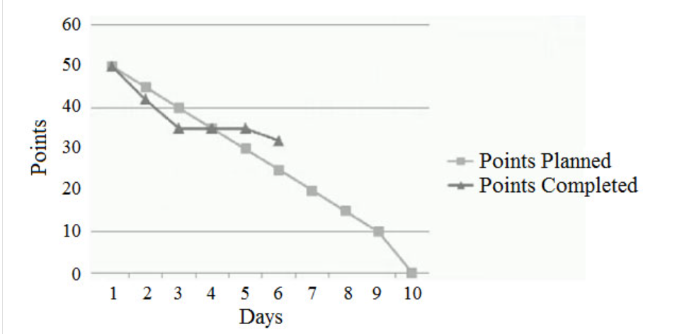

# 单选题

1. An agile practitioner notices that team members are disengaged. As a result, the team's velocity has decreased. What should the agile practitioner do to get the team back on track?
   - [ ] A. Escalate the issue to the project sponsor.
   - [ ] B. Remove stories to increase velocity.
   - [ ] C. Hold a standup to address the issue.
   - [ ] D. Facilitate a team retrospective.

   

      
Answer

      D:
      From PMI’s Agile Practice Guide, Page 51:
      However, the team does not need iterations in order to retrospect. Team members may decide to retrospect at these key times:
      - When the team completes a release or ships something. It does not have to be a monumental increment. It can be any release, no matter how small.
      - When more than a few weeks have passed since the previous retrospective.
      - When the team appears to be stuck and completed work is not flowing through the team.
      - When the team reaches any other milestone.”

   

2. During sprint retrospectives, some team members are very vocal and tend to dominate the conversation, while others are more reserved and less likely to participate. What should the scrum master do?
   - [ ] A. Encourage all team members to participate, and have them type their retrospective feedback into the agile lifecycle management tool.
   - [ ] B. Ask more specific questions during the retrospectives.
   - [ ] C. Use retrospective techniques, such as silent writing, clustering, and dot voting to field feedback prior to discussion by the team.
   - [ ] D. Ask team members to email feedback that can be summarized in a spreadsheet for the team.

   

      
Answer

      C: [ref](https://www.excella.com/insights/how-to-lead-an-effective-retrospective)

   

3. A product's scope and acceptance criteria have been defined, and the product is planned for release at the end of the next quarter.
What should the project team do next?
   - [ ] A. Estimate the project team's capacity.
   - [ ] B. Determine how much work can be delivered.
   - [ ] C. Calculate how much work will fit into the next iteration.
   - [ ] D. Estimate items in the product backlog.

   

      
Answer

      D:
      Steps to Planning a Release
      1. Determine condition of satisfaction
      2. Estimate user stories
      3. Select an iteration length
      4. Estimate velocity
      5. Proritize US
      6. Select stories and release date

   

4. Based on the chart, what is the current status of the iteration when comparing story points planned versus completed?

   

   - [ ] A. The iteration is in jeopardy.
   - [ ] B. The team has removed scope.
   - [ ] C. The iteration is ahead of schedule.
   - [ ] D. The team's velocity is constant.

   

      
Answer

      A.

   

5. During a daily stand up meeting, a developer expresses concerns that the selected technology limits the number of concurrent users.
What should the agile team lead do?
   - [ ] A. Ask the team to conduct research to find a viable solution.
   - [ ] B. Select a better technology for team implementation.
   - [ ] C. Obtain customer input on their technology requirements.
   - [ ] D. Consult the product owner about their non-functional requirements.

   

      
Answer

      D.

   

6. During backlog refinement meeting, the new developer on the team asks the product owner to discuss a new performance threshold requirement and how it impacts the stories in the backlog. What should the team do?
   - [ ] A. Add this threshold requirement request as acceptance criteria in all impacted stories
   - [ ] B. Create a spike story to analyze the impact of the threshold requirement on current stories
   - [ ] C. Conduct design planning session to review the performance threshold requirement
   - [ ] D. Identify the tasks for the new performance threshold requirement

   

      
Answer

      B.

   

7. A scrum master is part of a project team using technologies overseen by the IT department. The IT director oversees several company initiatives and is unfamiliar with the details of each one. As an active project stakeholder, to which meeting should the IT director be invited?
   - [ ] A. Planning
   - [ ] B. Daily scrum
   - [ ] C. Sprint demo
   - [ ] D. Retrospective

   

      
Answer

      C.

   

8. A company president is concerned about the impact of a natural disaster on the company. How should management identify areas to apply its resources and mitigate potential impacts?
   - [ ] A. Establish and keep an active risk register that includes mitigation strategies and a cost-benefit analysis.
   - [ ] B. Establish and keep an active risk register based on qualitative risk analysis and expected losses.
   - [ ] C. Have each development team post the highest risk development items on the information radiator.
   - [ ] D. Avoid risk by splitting development teams into two locations to ensure knowledge continuity.

   

      
Answer

      答案A。

   

9. After seeing the planned features for an upcoming release, a customer notes that a vitally important and complex one is missing. The team estimates that this feature significantly exceeds its average velocity. How can this issue be resolved?
   - [ ] A. Break down the feature into smaller parts, and commit to completing the minimum viable product.
   - [ ] B. Complete the iteration to which they have already committed, and include the feature in the next release.
   - [ ] C. Change the planned features to include only the vitally important one.
   - [ ] D. Extend the iteration to complete the feature.

   

      
Answer

      A: Release should provide value and slicing of feature is important because team estimated the entire feature would exceed velocity.

   

10. A new agile team member notices that the team's current process involves excessive documentation. What should the new team member do?
    - [ ] A. Teach the team the appropriate agile principle, obtain consensus, and drive adoption.
    - [ ] B. Allow another team member to prepare those documents that do not appear to bring value.
    - [ ] C. Notify the project manager about other documentation techniques, and identify which documents bring value and which do not.
    - [ ] D. Follow the existing process to avoid conflicts.

    

       
Answer

       A: Working software over comprehensive documentation.

    

11. An agile team discovers a new risk and identifies that its impact may be severe. What should an agile practitioner recommend?
    - [ ] A. Add a goal to the current iteration to fully mitigate or control the risk.
    - [ ] B. Balance risk reduction and value adding activities in the next iteration.
    - [ ] C. Continue with the current plan to maintain team velocity.
    - [ ] D. Update the risk register and seek direction from a risk specialist.

    

       
Answer

       B: A is wrong, You can't easily change sprint goal. All discovered risks are moved to risk-adjusted backlog or risk burndown chart. Balance risk reduction and value adding activities in the next iteration. I consider "Balance risk reduction and value adding activities" as risk-adjusted backlog. So it looks like the best answer - to deal with risk during next sprint.

    

12. The executive leadership wants to understand ways to better deliver on time and on budget. What can the project team do to assist in achieving the organizational goal?
    - [ ] A. Maintain and review a lessons learned repository to improve delivery of future projects.
    - [ ] B. Ask each team member to post corrective action to the backlog.
    - [ ] C. Engage the project management office (PMO) to take responsibility identifying lessons learned on projects.
    - [ ] D. Perform a root cause analysis to identify alternative approaches for performing the next project.

    

       
Answer

       A.

    

13. A scrum team has eight developers, but only two are database engineers. During the last few retrospectives, the team identified that most sprint stories are dependent upon database engineers. This has created a bottleneck in completing stories. What should be proposed to the team?
    - [ ] A. Have other team developers attend training to learn database skills.
    - [ ] B. Monitor the retrospectives of two additional sprints before taking action.
    - [ ] C. Plan fewer stories for the sprint to reduce the database engineers' workload.
    - [ ] D. Ask the scrum master to work with the product owner to remove backlog stories that have database dependency.

    

       
Answer

       A.

    

14. An agile project has three more iterations before the release. There is a lot of report functionality to be created and defects to be cleared. During a daily scrum, a team member suggests a timebox spike to find a more efficient way to deliver reports. What should the project leader do?
    - [ ] A. Encourage the team to self-organize and determine how to best complete their existing work and this spike.
    - [ ] B. Encourage the team to complete their just existing work since the team velocity indicates they are already struggling to meet the release goal.
    - [ ] C. Direct the team to defer the spike until the next release and add the action on the backlog for prioritization.
    - [ ] D. Direct the team to work on the spike immediately given the importance of reporting functionality to complete the iteration.

    

       
Answer

       A.

    

15. A globally distributed project team is using email and phone calls as the only way to share information. Delays in resolving issues often occur due to misinterpreted communications, leading to a lower team velocity. What steps should the project leader take to improve knowledge sharing?
    - [ ] A. Meet individually with each team member to identify the issues and relay information to the remaining members through status reports.
    - [ ] B. Establish a live video feed between the dispersed teams to enable spontaneous engagement and collaboration on issues.
    - [ ] C. Request that the customer co-locate the team to overcome the communication issues, as this is the only method to ensure agility.
    - [ ] D. Inform the customer of the challenges and lower velocity of the project to accommodate for the slower delivery pace.

    

       
Answer

       B.

    

16. During a Kanban team's daily stand up, an agile coach observes that the team seems disinterested in the work status. While it appears that there are no issues with flow, there is a marked lack of attention to team effort. When the agile coach queries the team for reasons, members explain that work continues to be scheduled with no end in sight. What should the agile coach do?
    - [ ] A. Work with the team to determine points at which to celebrate its work.
    - [ ] B. Provide the team with a break by scheduling a team event.
    - [ ] C. Have the team increase work in progress (WIP) levels to more quickly complete the flow.
    - [ ] D. Rejuvenate the team by temporarily reducing WIP levels.

    

       
Answer

       A: From PMI’s Agile Practice Guide, Page 37: “Celebrate team successes and support and bridge building activities with external groups. Create upward spirals of appreciation and good will for increased collaboration".

    

17. Agile team A struggles to deliver committed stories due to technical dependencies with team B, which continuously fails to meet its delivery commitments. What should the agile team lead do?
    - [ ] A. Create a new team to deliver the dependencies, and bring team B under performance management.
    - [ ] B. Conduct a vision-sharing session with the teams to communicate the project's overall goals.
    - [ ] C. Swap team members from both teams so that deliveries are better supported.
    - [ ] D. Discuss negotiating the delivery timelines with team A.

    

       
Answer

       B.

    

18. The team underestimated the complexity of a story, resulting in new decomposition of the work to be delivered in the current sprint and items to be returned to the backlog. What should the Scrum Master do next?
    - [ ] A. Ask the project manager to work with the product owner to help generate clearer stories in the future.
    - [ ] B. Develop guidelines to prevent future occurrences.
    - [ ] C. During the retrospective, discuss the issue and create an action plan to avoid it in the future.
    - [ ] D. Allow the team to devise a corrective action without external intervention.

    

       
Answer

       D: The question is What should the Scrum Master do next? SM should let the team deal with the issue themselves first, and discuss in the Retro later.

    

19. What estimation technique is an agile team using when collectively estimating the relative size of its stories using story points?
    - [ ] A. Parametric
    - [ ] B. One-to-one comparison
    - [ ] C. Affinity
    - [ ] D. Planning poker

    

       
Answer

       C. Not clear.

    

20. There is a database feature requiring three members of a seven person team. A meeting is scheduled at the beginning of the sprint to go over technical needs to complete the story. Who should the Scrum Master invite to the meeting?
    - [ ] A. The core team and the customer
    - [ ] B. The product owner and key stakeholders
    - [ ] C. The customer and the sponsor
    - [ ] D. The core team and the product owner

    

       
Answer

       D.

    

21. How should a project leader manage stakeholder expectations in an agile project?
    - [ ] A. Establish a common vision and success criteria and involve all the stakeholders in the iteration reviews.
    - [ ] B. Invite stakeholders for the iteration reviews but do not include new stakeholders which may limit project success.
    - [ ] C. Involve all the stakeholders in iteration reviews but do not entertain all expectations of all stakeholders.
    - [ ] D. Communicate issues to all stakeholders via email and only communicate risks to internal stakeholders.

    

       
Answer

       A.

    

22. The product owner wants to build security firewalls into the product. How can the team members support this?
    - [ ] A. Add new security features to the backlog and prioritize.
    - [ ] B. Execute a spike to research security features for the project.
    - [ ] C. Ask questions to determine where and how the product owner wants to use the product.
    - [ ] D. Ask questions to determine if the product owner can define the desired level of security.

    

       
Answer

       A. Not clear.

    

23. After a successful product deployment, a key stakeholder informs an agile team member that an implemented feature is failing to deliver its expected business value. The team member replies that the requirement was provided by the customer, and that the scope was clearly met. If the problem were an issue of requirement elicitation rather than delivery, what should have been done to avoid this situation?
    - [ ] A. Stakeholders should have regularly been engaged to obtain feedback and reduce the functionality risk.
    - [ ] B. The team should have used the lean principle of delay, so that actual facts could be considered rather than assumptions and predictions.
    - [ ] C. Interdependent teams should have been engaged using a collaborative approach to identify and leverage the best support.
    - [ ] D. An owner should have been identified to obtain timely stakeholder feedback.

    

       
Answer

       A.

    

24. During a retrospective, team members suggest process improvement ideas. The agile team lead knows that, while many of these ideas are different from standard practices, a few of them are good. What should the agile team lead do?
    - [ ] A. Require the team to try only those ideas that will ensure success.
    - [ ] B. Allow the team to try ideas, but remind them that results will be reviewed by high-ranking executives.
    - [ ] C. Associate idea successes and failures with the team's incentive plan to ensure accountability.
    - [ ] D. Encourage the team to try the ideas, even if failure may be the outcome.

    

       
Answer

       D: From PMI’s Agile Practice Guide, Page 61: “Learning takes place by experimenting, delivering small increments of value, and getting feedback on what has been accomplished thus far.”

    

25. An agile team's client has been asked to expedite the delivery of the next release. By delivering one month early, the company can generate US$40,000 more than expected for the quarter. What should the agile team do?
    - [ ] A. Adhere to the new deadline and immediately advise the client that the schedule has been expedited.
    - [ ] B. Advise the client that it is best to continue as planned rather than introduce unforeseen risks by expediting the schedule.
    - [ ] C. Submit a change request to the client with a 50% increase in charges due to the new potential profit.
    - [ ] D. Request additional resources to meet the expedited deadline and obtain training for the new resources.

    

       
Answer

       B: Agile processes promote sustainable development. The sponsors, developers, and users should be able to maintain a constant pace indefinitely.

    

26. An agile team has been in place for five years and the customer is satisfied with the team's performance and deliverables. Now that the product is built and delivered, the customer is considering the future role of the Scrum Master. What should the customer do?
    - [ ] A. Expand the Scrum Master's role to other projects, while allowing them to support the current project.
    - [ ] B. Release the Scrum Master, since the team is adequately skilled with agile practices.
    - [ ] C. Expand the product owner's role to serve as the Scrum Master, while providing additional product knowledge.
    - [ ] D. Increase the functional manager's role to act as the Scrum Master, while providing additional information about functional areas.

    

       
Answer

       A: I thingk A is the better option. This reference is from Scalade. That could kill the transformation before it even gets started, and before the teams have had a chance to prove the value of the role. Therefore, SAFe takes a pragmatic approach and assumes, in general, that the Scrum Master is a part-time role. During initial SAFe adoption, however, the job may be more intensive. At this stage, the organization may find it beneficial to bring external consultants on board to coach the teams while they become experienced in Scrum and SAFe. These outside consultant Scrum Masters will often coach multiple teams in the organization

    

27. An agile team lead is assigned to a project that must ensure data security. What should the team lead do to guarantee that security, as a non-functional requirement, is managed throughout the project?
    - [ ] A. Include security concerns on the agenda for every meeting.
    - [ ] B. Request that a security expert be added to the team.
    - [ ] C. Add security as a non-functional requirement to the risk register, and review regularly.
    - [ ] D. Ensure that planning and prioritizing includes consideration of security requirements.

    

       
Answer

       D.

    

28. An agile team delivered a feature in the last iteration. The product owner, who missed the planning and review meetings, was dissatisfied with the feature. The team conducted a retrospective and reviewed the user stories related it. What should the agile team do next?
    - [ ] A. Ensure that the product owner reviews the acceptance criteria for delivered user stories.
    - [ ] B. Augment the quality assurance and continuous integration processes for delivery.
    - [ ] C. Approach the relevant developers and testers regarding quality issues in upcoming iterations.
    - [ ] D. Ask the product owner to define the entire scope of delivery two to three iterations in advance.

    

       
Answer

       A.

    

29. An agile team and a traditional development team are working together on a project. Each team exceeds expectations regarding deliverables; however, issues arise when the deliverables are integrated. What should the agile practitioner do?
    - [ ] A. Foster stronger communication by hosting cross-organizational meetings between the two teams.
    - [ ] B. Suggest merging the teams to avoid misunderstandings.
    - [ ] C. Create stories from full technical specifications to avoid ambiguity.
    - [ ] D. Co-locate the teams to encourage osmotic communication.

    

       
Answer

       D: This question seems communication issue.

    

30. After three iterations, it is identified that a project's underlying security structure architecture is unstable. While there is a technical solution, all work to date is flawed. This will impact several future business service offerings. What should the product owner do to resolve this?
    - [ ] A. Ask the development team to address the issue since it is in their domain.
    - [ ] B. Review the project's risk matrix, and follow the steps outlined in the risk mitigation plan.
    - [ ] C. Meet with the team and stakeholders to address rework and rewrite stories as needed.
    - [ ] D. Cancel the current sprint, and meet with stakeholders to reassess the project's validity.

    

       
Answer

       C.

    

31. A product owner obtains customer confirmation on product requirements and provides them to the team. After explaining the user stories, the product owner receives agreement for acceptance from the team. What should the team do next?
    - [ ] A. Use agile estimation techniques to create a shared understanding of when the user stories will be completed.
    - [ ] B. Agree upon development and testing activities for the user stories.
    - [ ] C. Complete the user stories, and provide a demo for the product owner and customer.
    - [ ] D. Complete the user stories, and hold a retrospective to discuss them.

    

       
Answer

       A.

    

32. Midway through a two-week sprint, an agile team realizes that the features cannot be delivered within the sprint. The team determines that another week will be required to complete all committed features. What should the team do?
    - [ ] A. Plan for overtime, and include the effort as part of the estimation.
    - [ ] B. Increase team velocity to deliver more story points.
    - [ ] C. Identify the reason for over-commitment to the sprint and create an action plan for the following sprint.
    - [ ] D. Add resources to assist with sprint execution.

    

       
Answer

       C.

    

33. A key stakeholder cannot attend the project vision statement development workshop. The stakeholder has emailed their requirements to the agile team lead, and believes that the vision statement is not critical. How should the agile team lead respond?
    - [ ] A. Emphasize to the stakeholder that a common, detailed vision will better ensure team understanding of the project.
    - [ ] B. Personally meet with the stakeholder to understand their requirements, and then share the vision with the team.
    - [ ] C. Work with the team to create a vision from the stakeholder's supplied requirements.
    - [ ] D. Explain to the team that creating a vision is not critical in agile projects, as requirements may change over time.

    

       
Answer

       A.

    

34. During the implementation of a story, a scrum team notifies the scrum master of a technical challenge that is causing a delay. What should the scrum master advise the team to do?
    - [ ] A. Implement the story since the team is running behind schedule.
    - [ ] B. Create a spike to finalize the story's technical approach.
    - [ ] C. Transfer the story to a scrum team experienced in solving similar problems.
    - [ ] D. Ask the product owner to reduce the story's priority and wait until more technical details are available.

    

       
Answer

       B.

    

35. At the retrospective, the burndown chart shows that the project is slightly behind schedule. The project team identifies an inexperienced software engineer as the source of reduced velocity. How should the project team address this issue?
    - [ ] A. Suggest pair programming during the retrospective.
    - [ ] B. Ask the product owner to re-prioritize the user stories at the next retrospective.
    - [ ] C. Re-estimate the story points with team members at the next iteration planning meeting.
    - [ ] D. Assign less complex user stories to the inexperienced software engineer at the next iteration planning meeting.

    

       
Answer

       A.

    

36. A team working with a new technology faces a significant amount of uncertainty about its ability to deliver stories due to technical issues. What should the team do?
    - [ ] A. Capture risks and make them visible, and use a burn down chart to focus on reducing risks early in the project.
    - [ ] B. Ask the scrum master to extend the sprint's duration to allow more time to work through technical issues.
    - [ ] C. Place the impacted stories on the story board, and use daily stand ups to make the product owner aware of the technical issues.
    - [ ] D. Seek guidance from the development manager.

    

       
Answer

       A: Issues in agile means risks, which occurred. Agile team should mitigate high risk high value as early as possible.

    

37. A project sponsor is upset that an enhancement will be unavailable until next year. What should the product owner do?
    - [ ] A. Accept responsibility for the product's delay.
    - [ ] B. Ensure that the project sponsor's priorities are in the product backlog.
    - [ ] C. Negotiate with the project sponsor for increased funding.
    - [ ] D. Empower the project sponsor to manage the product backlog.

    

       
Answer

       A.

    

38. A project manager is concerned that the team has misaligned expectations with some stakeholders, and that user stories were written only from a generic user's perspective. This may lead the team to miss stories for non-generic users. What agile tools can help the team address these issues?
    - [ ] A. Information radiators and wireframes.
    - [ ] B. Information radiators and story maps.
    - [ ] C. Process flows and personas.
    - [ ] D. Personas and extreme characters.

    

       
Answer

       D:
       - Process flow relates to the selected agile methodology/framework rather than product user experience.
       - Extreme character let you identify non-generic users.

    

39. Throughout the project, an agile practitioner notices that one team member is becoming an emergent leader. What should an agile practitioner do?
    - [ ] A. Present opportunities in order to be supportive and grow that team member's talents.
    - [ ] B. Encourage the team member to fit in more with the established team norms.
    - [ ] C. Bring this to management's attention so they don't disrupt the team.
    - [ ] D. Ask team member to respect defined roles on the project to avoid confusion with the team.

    

       
Answer

       A.

    

40. Unable to meet a sprint's committed velocity, an agile team approaches the agile coach to define the next sprint's velocity. What should the agile coach advise?
    - [ ] A. Split each story into multiple stories to meet the desired velocity.
    - [ ] B. Set the velocity to the delivered story points of the last sprint.
    - [ ] C. Use different estimation methods for stories and defects to meet the desired velocity.
    - [ ] D. Re-estimate by assigning more story points to smaller stories to increase the velocity.

    

       
Answer

       B: Use the last velocity to set the new one.

    

41. The project team is ahead of schedule and beginning to gold-plate the feature included in the current sprint. What should the agile project manager do?
    - [ ] A. Since the team has extra time, notify the product owner and secure approval for the extra work on this feature.
    - [ ] B. Encourage the team to document the improvement and prioritize it for the upcoming iteration, instead of building it now.
    - [ ] C. Instruct the Scrum Master to have the team use the extra time to complete the extra feature work in the current iteration.
    - [ ] D. Notify the product owner and have the product owner verify the backlog priority, then encourage team to continue working on the backlog.

    

       
Answer

       D.

    

42. What is the first thing an agile development team should do when planning an iteration?
    - [ ] A. Assign the tasks to one team member.
    - [ ] B. Separate the stories into tasks.
    - [ ] C. Estimate the stories' tasks.
    - [ ] D. Help establish the next sprint's goal.

    

       
Answer

       D: The order is DBCA.

    

43. Two teams have received project requirements and completed estimates. Team A estimates 420 story points for scope and 30 story points for velocity per sprint. Team B estimates 280 story points for scope and 20 story points for velocity per sprint. Both teams have same number of team members and have an assumed sprint duration of 2 weeks.What can an agile practitioner conclude about team A and team B's estimates?
    - [ ] A. Team B has underestimated scope compared to team A.
    - [ ] B. Team A is more confident in delivering velocity than team B.
    - [ ] C. Both teams need to indicate their proposed technology before the estimates can be analyzed.
    - [ ] D. Both teams have estimated the project to be of same size.

    

       
Answer

       D: Team A estimate is 420/30 = 14 sprints to complete the project. Team B estimate is 280/20=14 sprints to complete the project. So, the answer is D.

    

44. An agile team is unable to complete all its planned sprint user stories, which results in a decrease of its planned sprint velocity. What should the team do?
    - [ ] A. Re-estimate the sprint's completed stories to increase and adjust the sprint's velocity.
    - [ ] B. Increase the duration of the next sprint to accommodate the incomplete user stories and maintain velocity.
    - [ ] C. Work with the product owner to create a spike with another agile team.
    - [ ] D. Re-estimate the incomplete stories for the next sprint because its relative size has changed.

    

       
Answer

       D: Once stories get completed it is useless to re estimate them again, the team should always focus on stories not yet completed for prioritization and refreshing the backlog before starting the next sprint.

    

45. A new project starts and team members are pooled together to execute it. The team works together and moves from the forming stage into the storming stage. However, potentially destructive conflicts are now arising. What should the agile coach do to develop members into a high-performance team?
    - [ ] A. Teach the team how to work comfortably in chaos.
    - [ ] B. Provide strong facilitation and conflict-resolution guidance.
    - [ ] C. Allow the team to resolve issues on their own.
    - [ ] D. Observe each team member and advise them on team relationships.

    

       
Answer

       B: The storming phase the conflict occurs between team members so the role of SM/Coach is to be ready to facilitate guidance to resolve conflicts among them.

    

46. The amount of information captured in the project's defects is varying within the development team. Team members are becoming frustrated with the defect quality inconsistencies and the frequent clarification required. What should be done to address the issue?
    - [ ] A. Stop the current iteration to discuss defect quality issues and explore solutions.
    - [ ] B. Discuss and explore solutions in the next planning meeting and take corrective actions as required.
    - [ ] C. Generate insights at the next retrospective and adjust processes as decided by the team.
    - [ ] D. Assign corrective actions to the backlog for the team to identify the mandatory defect information.

    

       
Answer

       C.

    

47. At the end of a product development phase, an agile project team confirms that all tests have passed. The product is released, but the customer complains that it is deficient. What should the project team have done prior to product release?
    - [ ] A. Requested approval from the project sponsor
    - [ ] B. Undertaken a review of all requirements
    - [ ] C. Conducted an end-of-phase demonstration
    - [ ] D. Performed a retrospective to validate project deliverables

    

       
Answer

       C: Demo is necessary to get customer feedback. If demo was performed before release, customer would have identified deficiencies.

    

48. What should a team consider when calculating the effort needed to complete a product backlog?
    - [ ] A. The increase in velocity and cost
    - [ ] B. A buffer in the sprint to mitigate unexpected risks
    - [ ] C. Assigning extra points to each task to allow time for changes
    - [ ] D. Stories describing infrastructure tasks and analysis tasks

    

       
Answer

       B.

    

49. A scrum master assumes a project that is essential to organizational growth. The project is expected to be in production for three years. What should the scrum master do first?
    - [ ] A. Work with the customers to build the product backlog and identify their initial requirements.
    - [ ] B. Meet with the stakeholders and enterprise architects to understand the project's vision.
    - [ ] C. Plan and execute a sprint 0 to establish the project's foundational needs.
    - [ ] D. Create a backlog, and execute a sprint 1 to quickly deliver value to the customers.

    

       
Answer

       B: Remember Sprint Panning and execution is not done by the SM only. This is done by the team. SM bridges the Dev. Team and the Stakeholders.

    

50. Why should an agile coach model agile principles and behaviors, become self-aware, and be present?
    - [ ] A. To better listen, serve and help the team grow their strengths individually and as a team
    - [ ] B. To convince people what they need to do
    - [ ] C. To help better disguise the command and control approach
    - [ ] D. To understand team dynamics and develop a high performing team

    

       
Answer

       A.

    

51. Following an upgrade, a software support team is overwhelmed by the number of tickets being submitted by end users. The team's manager is pushing the team to "work smart" by focusing on activities that deliver the most value in the least amount of time. What should the team do?
    - [ ] A. Work longer hours to complete more of the support backlog.
    - [ ] B. Work support tickets in the order in which they were received.
    - [ ] C. Place tickets on hold until the team completes an analysis of the backlog to identify and resolve systemic issues.
    - [ ] D. Add members to the support team.

    

       
Answer

       C.

    

52. On what should an agile team work to achieve predictable flow?
    - [ ] A. Small user stories
    - [ ] B. Simple acceptance criteria
    - [ ] C. Lean features
    - [ ] D. Lean backlogs

    

       
Answer

       A: Small stories make flow more predictable because small stories are more manageble then large one.

    

53. An agile project leader is delivering a team kick-off session. The first exercise is a "Life Timeline", a story-telling exercise where each team member tells their life story, explains how they experienced the highs and lows of their journey, and identifies their fears and hopes. What is the project leader trying to create?
    - [ ] A. A safe space for team members to learn to trust one another, leading to collaborative relationships.
    - [ ] B. A safe space for team members to learn to be vulnerable, leading to high performance relationships.
    - [ ] C. A safe space for team members to learn to share, leading to collaborative relationships.
    - [ ] D. A safe space for team members to learn about each other's weaknesses and strengths.

    

       
Answer

       A: From PMI’s Agile Practice Guide, Page 47: “The best place to start when forming agile teams is by building a foundational trust and a safe work environment to ensure that all team members have an equal voice and can be heard and considered. This, along with building the agile mindset is the underlying success factor—all other challenges and risks can be mitigated.”

    

54. What should the agile practitioner know about tracking velocity?
    - [ ] A. A team with an average velocity of 50 is twice as efficient as a team with an average velocity of 25.
    - [ ] B. A team with an average velocity of 50 is equally as efficient as a team with an average velocity of 25.
    - [ ] C. A team that consistently meets its planned velocity is more efficient than a team that consistently exceeds its planned velocity.
    - [ ] D. A team that consistently meets its planned velocity is less efficient than a team that constantly exceeds its planned velocity.

    

       
Answer

       C: Constantly exceeding your planned velocity doesn't make you efficient.

    

55. During an iteration, an agile team discovers infrastructure requirements that were not initially considered. What should the team do to effectively manage this?
    - [ ] A. Rework the iteration scope to accommodate these requirements.
    - [ ] B. Add these requirements into the product backlog for future consideration.
    - [ ] C. Raise the discovery of these requirements as an issue, and escalate to management.
    - [ ] D. Immediately start working on these requirements.

    

       
Answer

       B.

    

56. During a project's last few sprints, an agile practitioner notices an increase in defects. A root-cause analysis indicates that a poor understanding of the requirements was caused by the inability of the product owner to communicate clearly. What should the agile practitioner do?
    - [ ] A. Inform the product owner's manager so that corrective action may be taken.
    - [ ] B. Communicate this to the product owner, and offer to help facilitate discussions with the team.
    - [ ] C. Encourage a team member to raise this during the retrospective to ensure that the product owner is aware.
    - [ ] D. Escalate this issue to the sponsor so that corrective action may be taken.

    

       
Answer

       B.

    

57. An event management team is following an agile approach to prepare for an upcoming conference. The regional sales manager, from where the conference is to be held, contacts the team with a number of questions about the company's booth. What should the team do?
    - [ ] A. Inform the sponsor about the regional sales manager's disruptiveness and ask that all questions be diverted to the weekly meetings.
    - [ ] B. Stay focused on the current iteration and let the project manager deal with the regional sales manager's questions.
    - [ ] C. Invite the regional sales manager to the next iteration review to share the progress.
    - [ ] D. Create a risk on the risk register to account for some potentially new requirements from the regional sales manager.

    

       
Answer

       B: First, the question asking about something related to company's booth which is not related to product or value. Secondly, the team should focus on the sprint and the leader should shied them from any interruption. Therefore, B answers one of the Project leader role to shied the team during the sprint.

    

58. An agile team is working well together, but productivity has been flat. What can the project leader do to help them improve performance?
    - [ ] A. Review the burndown chart to identify ways to increase efficiency.
    - [ ] B. Chair a weekly team retrospective focusing on identifying areas for continuous improvement.
    - [ ] C. Ask a senior manager to initiate a root-cause analysis.
    - [ ] D. Identify team key performance indicators (KPIs) and create positive incentives when targets are achieved.

    

       
Answer

       B: Use retrospective to learn and improve. Team is not learning or improving, that's why productivity is flat.

    

59. During an iteration planning meeting, the team suggests changes to add product value that will require extra work and impact the schedule. What should the agile project leader do?
    - [ ] A. Re-estimate the project.
    - [ ] B. Finish the product as it was initially planned.
    - [ ] C. Try to include as many changes as possible.
    - [ ] D. Ask the product owner for approval to proceed.

    

       
Answer

       D.

    

60. What can a team use to prioritize stories?
    - [ ] A. MoSCoW method
    - [ ] B. Planning poker technique
    - [ ] C. Weighted average calculation
    - [ ] D. INVEST scale

    

       
Answer

       A.

    

61. The agile practitioner has determined that two different team members are working on addressing the same major issue on the project. How should the agile practitioner address this?
    - [ ] A. Implement a burnup chart and add the issue resolution as a task to the product backlog for the customer to prioritize.
    - [ ] B. Add the issue to the kanban board and assign it to the team member who has made the most progress on resolving it.
    - [ ] C. Conduct a root-cause analysis on the issue and identify related risks and risk response owners at the next retrospective.
    - [ ] D. Document all project issues in a common space and ask the team members to decide on task allocation principles.

    

       
Answer

       D.

    

62. A development team, new to scrum, questions the need to collect metrics on team performance. While team members understand velocity and burn down, they feel that once velocity becomes settled it is needless to keep track. What should the agile coach tell the team?
    - [ ] A. Continuing to track velocity allows functional managers to assess whether or not the team is performing at the desired rate.
    - [ ] B. The trends will show how the team performs against other scrum teams in the organization.
    - [ ] C. Tracking velocity will provide a baseline for the team to see how their continuous improvement efforts are working.
    - [ ] D. Tracking velocity will document and communicate team health to the stakeholders.

    

       
Answer

       C.

    

63. A product owner adds a 21-point, high-priority story to a sprint backlog. The team is concerned that it cannot be completed during the current sprint. What should the team do?
    - [ ] A. Advise the product owner that the story will have to wait until the next sprint.
    - [ ] B. Work extra hours to complete the story and satisfy the customer's requirements.
    - [ ] C. Break down the story into smaller increments and negotiate other stories on the sprint backlog.
    - [ ] D. Increase the length of the sprint to accommodate the story.

    

       
Answer

       C.

    

64. How can a scrum team obtain more feedback from a minimally responsive outside stakeholder?
    - [ ] A. Keep sprints short.
    - [ ] B. Invite the stakeholder to the daily stand ups.
    - [ ] C. Ask the stakeholder for estimates for each user story.
    - [ ] D. Schedule more demos during each sprint.

    

       
Answer

       A.

    

65. During mid-sprint changes, an agile facilitator meets with the executive and development teams. During the meeting, executive team members resolve conflicts, and on their own initiative, review the iteration charts to discuss changes to the iteration's functional goal. What practice is the agile facilitator implementing?
    - [ ] A. Building openness and transparency on the project's health and status
    - [ ] B. Facilitating conflict resolution among executive team members
    - [ ] C. Using active stakeholder involvement to build features in an incremental and iterative approach
    - [ ] D. Seeking continuous feedback from executive team members

    

       
Answer

       D.

    

66. A Scrum Master would like to provide information to key stakeholders on the daily resource and project activities.Which tool should the Scrum Master use to provide these updates?
    - [ ] A. Shared vision statement and sprint goal
    - [ ] B. Release burnup chart
    - [ ] C. Velocity metrics
    - [ ] D. Iteration burndown chart

    

       
Answer

       D.

    

67. A team is delivering work as per the sprint plan, and team velocity is stabilized. However, at the end of the release, the customer is dissatisfied with project quality.What should the agile project manager have done to avoid this?
    - [ ] A. Invited end customers to attend the stand ups
    - [ ] B. Organized design review sessions with the customer to obtain sign-off
    - [ ] C. Held regular meetings with the product owner and project team to elicit detailed business requirements
    - [ ] D. Conducted frequent review meetings with the customer to continually enhance delivery effectiveness

    

       
Answer

       D.

    

68. A scrum team has conducted regular retrospectives to discuss immediate concerns and the implementation of improvement actions. Despite this, after a few iterations, the same concerns resurface. What should the team have done to improve retrospective outcomes?
    - [ ] A. Invited subject matter experts (SMEs)
    - [ ] B. Conducted problem detection to determine root causes
    - [ ] C. Measured and reported the outcome of improvement actions to the team
    - [ ] D. Kept track of all current issues in a log, and then reviewed their progress at the end of every iteration

    

       
Answer

       B.

    

69. During a daily stand up, the tester engages the developer in a discussion about what will be tested during unit testing versus regression testing. What should the scrum master do?
    - [ ] A. Ask the tester and developer to discuss it after the meeting, since it is not a part of the daily stand up.
    - [ ] B. Encourage the discussion to resolve impediments.
    - [ ] C. After the meeting, escalate this issue to the tester's supervisor to ensure that this does not reoccur.
    - [ ] D. Ask more questions about the testing techniques to obtain clarification on team efforts for quality improvements.

    

       
Answer

       A: From PMI’s Agile Practice Guide, Page 54: “Another antipattern typically seen in standups is that the team begins to solve problems as they become apparent. Standups are for realizing there are problems—not for solving them. Add the issues to a parking lot, and then create another meeting, which might be right after the standup, and solve problems there.”

    

70. Stakeholders have conflicting requirements, and the product owner is struggling to decide which user stories to write. What should the product owner do?
    - [ ] A. Ask the agile practitioner to help write the user stories.
    - [ ] B. Ask the agile team to facilitate a story-writing workshop.
    - [ ] C. Ask subject matter experts (SMEs) to help write the user stories.
    - [ ] D. Ask the agile practitioner to facilitate a story-writing workshop.

    

       
Answer

       - [ ] A. Coach is not responsible nor have qualification in priorities and stories.
       - [ ] B. Team is not responsible for coaching stakeholders.
       - [ ] C. This answer leads us force some opinion and NOT engage the team/stakeholders
       - [x] D. You coach stakeholders about agile and you engage all relevant people via workshop to make a group decision (buy-in etc)

    

71. An agile team provides feedback that user stories include insufficient details to understand the requirements. What should the agile practitioner do?
    - [ ] A. Coach the product owner to update only the acceptance criteria.
    - [ ] B. Instruct the agile team to fix the user stories during the next retrospective.
    - [ ] C. Facilitate a user story workshop with the agile team.
    - [ ] D. Inform the product owner's manager that the work items provide insufficient detail.

    

       
Answer

       C.

    

72. A senior team member feels underutilized. What should the agile practitioner do?
    - [ ] A. Transfer the senior member to another team that will more fully utilize their skill set.
    - [ ] B. Conduct a performance evaluation to determine whether or not this member is a team player.
    - [ ] C. Encourage the project team to involve the senior member in more project activities.
    - [ ] D. Ask the functional manager to determine the best course of action.

    

       
Answer

       C.

    

73. Business stakeholders of an agile project frequently skip the review meetings. What should the agile practitioner do?
    - [ ] A. Ask the product owner to inform all stakeholders about the project's progress.
    - [ ] B. Send meeting notes to all stakeholders after each review meeting.
    - [ ] C. Include the results of the review meetings in the information radiators.
    - [ ] D. Convince the stakeholders of the benefits of attending the review meetings.

    

       
Answer

       D.

    

74. An agile practitioner becomes a Scrum Master on an established Scrum team. After introductions, what should the agile practitioner do?
    - [ ] A. Coach team members to improve functional specialties and increase overall velocity.
    - [ ] B. Identify where team processes misalign with accepted Scrum practices.
    - [ ] C. Facilitate the identification of problems or issues and help the team resolve them.
    - [ ] D. Review the backlog to ensure that it is prioritized, refined, and properly tasked.

    

       
Answer

       C.

    

75. An agile team is working on the first sprint, and have already planned the second and third sprints. However, market conditions now require a change to the features. What should the product owner do?
    - [ ] A. Communicate the importance of the business need to the team and refine the product backlog.
    - [ ] B. Ask the team to discuss the changes to the features with the customer.
    - [ ] C. Meet with the agile team lead to prioritize the requirements.
    - [ ] D. Discuss and prioritize the requirements with the team.

    

       
Answer

       A.

    

76. While attending a conference, an agile practitioner learns of a new user interface (UI) framework that could benefit the team. What should the agile practitioner do next?
    - [ ] A. Identify a team member to do a proof of concept using this framework.
    - [ ] B. Email the team directing them to immediately begin using this new framework.
    - [ ] C. Obtain feedback from team members on the new framework, and then suggest that the product owner create a backlog item to do a spike on it.
    - [ ] D. Discuss this option at the next retrospective.

    

       
Answer

       C.

    

77. A product owner with experience in a predictive approach wants the team to develop very detailed schedules and cost estimates for the next 10 sprints. What should the Scrum Master do?
    - [ ] A. Suggest the product owner start by focusing on the next 2 sprints instead of 10
    - [ ] B. Spend the first few sprints to develop detailed schedules and budgets
    - [ ] C. Invite the product owner to the retrospective to explain the team's approach to schedule and budget
    - [ ] D. Explain that detailed project schedules and budgets are not artifacts in agile projects

    

       
Answer

       D.

    

78. During a six-week iteration, an issue is identified by a team member. After analysis, the team member determines that it will take at least two weeks to resolve. What should the team member do?
    - [ ] A. Notify the product owner and begin resolution.
    - [ ] B. Communicate the issue to the team in the next stand up meeting.
    - [ ] C. Immediately begin resolution, and communicate it to the team during the retrospective.
    - [ ] D. Work on the next activity, and communicate it to the team during the retrospective.

    

       
Answer

       B.

    

79. An agile team identifies that their velocity is lower than predicted, and that their previous forecasts in the product roadmap are wrong. The team is worried that they will be unable to meet a critical release date without corrective action. What should the team do?
    - [ ] A. Collaborate with the product owner to reprioritize the product backlog, thus ensuring that more features will be completed before the release.
    - [ ] B. Ask the team lead to calculate the team's target velocity according to the project plan, and assign additional resources to increase capacity.
    - [ ] C. Focus on velocity and schedule concerns during the retrospective to inspect, adapt, and improve the process and plans.
    - [ ] D. Reestimate the backlog items from the release, ensuring that contingency is included to set stakeholder expectations.

    

       
Answer

       C.

    

80. A new CIO advocates an agile framework for new IT projects, but the team has reservations. How should the CIO ensure that the team will be aligned with this?
    - [ ] A. Obtain executive team buy-in by conducting a meeting to present the advantages of agile principles and processes.
    - [ ] B. Issue a memo of understanding that agile principles should be implemented for all new projects.
    - [ ] C. Introduce agile principles and processes, then make the change an experiment to obtain buy-in.
    - [ ] D. Require all staff and management to attend agile training and adhere to its principles.

    

       
Answer

       C.

    

